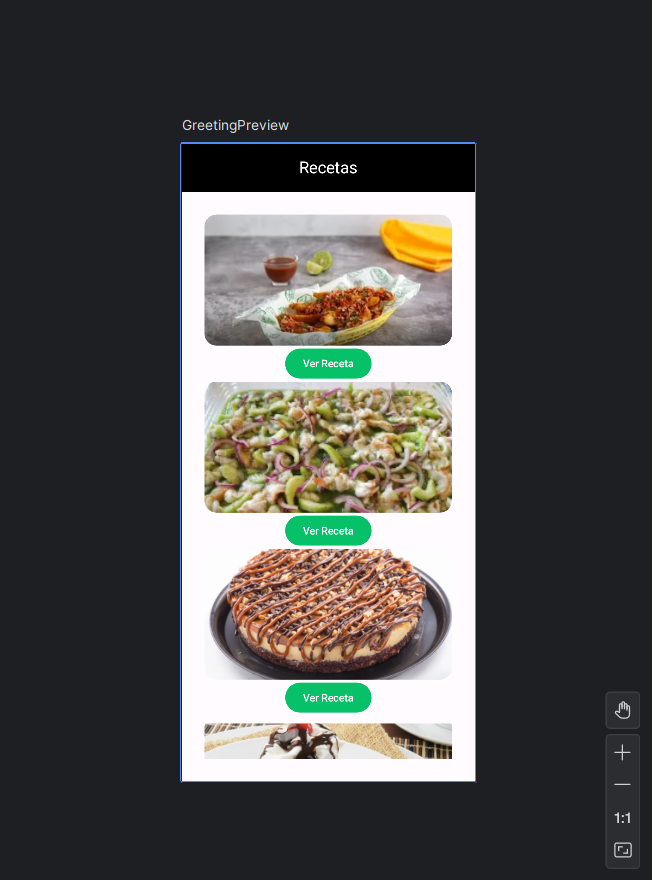
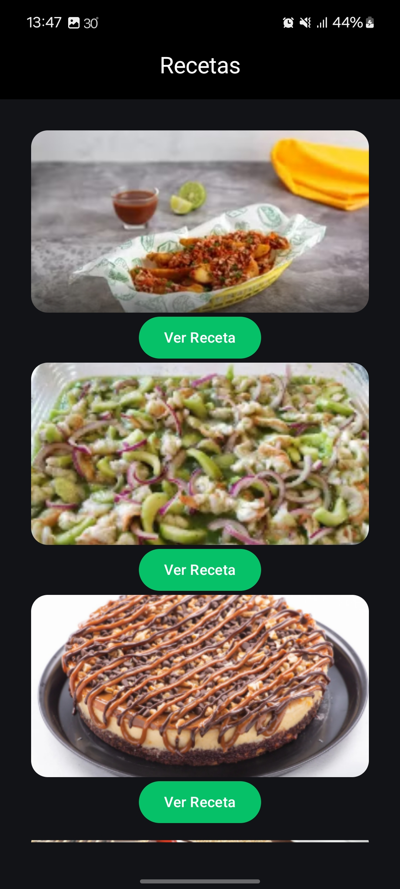
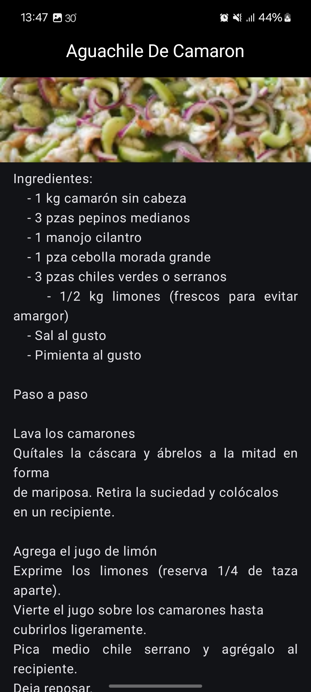

# Recetario

## Descripción

Recetario es una aplicación móvil inspirada en Uber Eats que permite explorar recetas de cocina con una interfaz atractiva y moderna.

## Características
-  Explora recetas con imágenes atractivas.
-  Botones de navegación.
-  Diseño elegante con colores en negro y verde.

